 

## 💫 About Me

- 🔭 Currently working on **AI-powered web applications and full-stack projects**
- 🌱 Learning **Advanced JavaScript, React.js, Data Structures & Algorithms, and AI**
- 👯 Looking to collaborate on **Open Source, Web Development, and AI/ML projects**
- 🤝 Looking for help with **building scalable applications and improving problem-solving skills**
- 💬 Ask me about **C++, JavaScript, React.js, Full Stack Development, and my projects**
- ⚡ Fun fact: **I love turning ideas into real-world projects and learning by building!**

 

## 🚀 Featured Projects

- **SafeRoute AI**: women safety navigation app (React, Firebase, Vite). Top 250 Finalist at the Elite Her Hackathon.
- **AI-Based Internship Recommendation Engine**: skill and resume based internship matching (React, Python, MongoDB). *In progress.*
- **Hand Gesture Laptop Controller**: control cursor, clicks, scroll and volume with hand gestures (Python, OpenCV, MediaPipe).

 

## 💻 Tech Stack

 

## 📊 GitHub Stats

 

## 🌐 Connect

&nbsp;&nbsp;
&nbsp;&nbsp;

